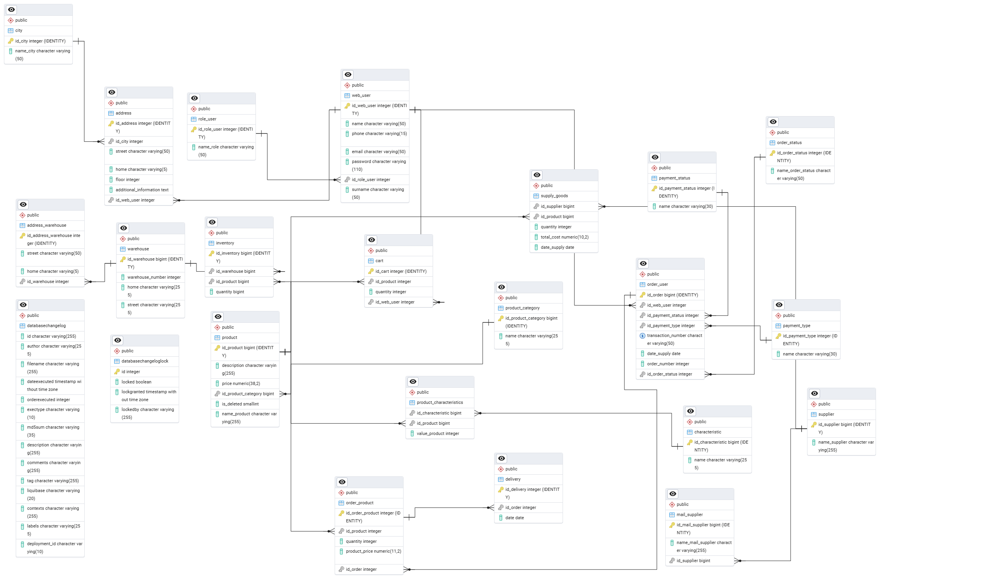

# online-shop-user

> Description:
>This module is part of a larger Spring Boot-based REST API for an online shop powered by PostgreSQL.
>It handles user registration and authentication, shopping cart management, and order processing.
>The service comes with built-in Swagger API documentation and supports containerized deployment via Docker for easy setup and scalability.

Database layout in pgAdmin 4

_________
## Swagger REST API docs:
http://localhost:8090/swagger-ui/index.html#/
_________

## Models

+ city
+ address
+ role_user
+ web_user
+ address_warehouse
+ warehouse
+ ProjectParticipants
+ confirmation_token
+ inventory
+ product
+ cart
+ product_characteristics
+ order_product
+ delivery
+ product_category
+ supply_goods
+ payment_status
+ order_user
+ characteristic
+ mail_supplier
+ supplier
+ payment_type
+ order_status
+ payment_status

_________

## 🐳 Running with Docker Compose

The project includes a pre-configured `docker-compose.yml` file that launches the following services:

- **PostgreSQL** — main database `rinma_shop` (port `5433` on the host)
- **user-app** — user management service (port `8090`)
- **product-app** — product management service (port `8091`)
- **Redis** — in-memory cache (port `6379`)
- **Kafka** — message broker (port `9092` inside the container, accessible from the host via `29092`)

### 1. Build and start

```bash
docker compose up --build -d
```
_________

### 🔗 Related Modules

- **Product Service**  
Manages product catalog, product supply operations, and warehouse inventory tracking.  
[➡ View on GitHub](https://github.com/LestFeeD/online-shop-product)


